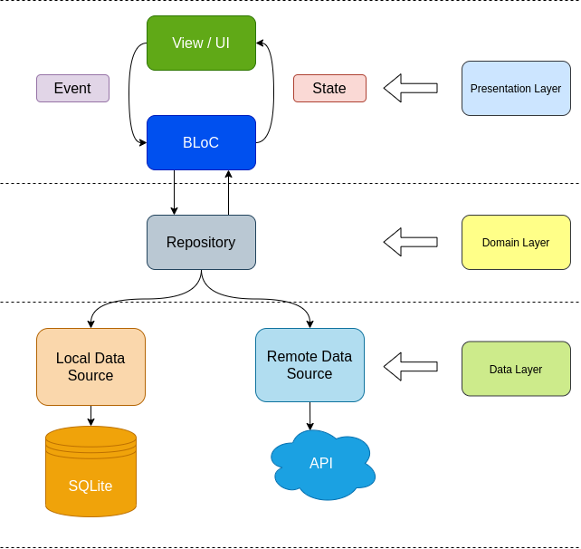

# Flutter Clean Arch

An example Flutter clean architecture component based on [Android Architecture Component](https://developer.android.com/jetpack/guide).

<p align="center">
  
</p>

# Package
- [Dio](https://pub.dev/packages/dio) for network services.
- [Moor](https://pub.dev/packages/moor) for persistance data.
- [Kiwi](https://pub.dev/packages/kiwi) for dependency injection
- [Flutter BLoC](https://pub.dev/packages/flutter_bloc)

# Test
Before you running the unit test there is some prerequirement for SqlLite, read this [docs](https://pub.dev/documentation/dart_sqlite3/latest/)

- For Linux, you should make sure, sqlite dev lib installed on your system. For example, there are packages for ubuntu.
```
% sudo apt-get install sqlite3 libsqlite3-dev
```
- For Mac, user can install with brew.
```
% brew install sqlite3 
```
- For Windows, user can download dll from [SQLite](https://www.sqlite.org/download.html)


# Article
Hey you can read this [article](https://medium.com/@derangga/flutter-clean-architecture-bloc-streams-89fc2c9146f) for the explaination, but it's Indonesia version 🙂