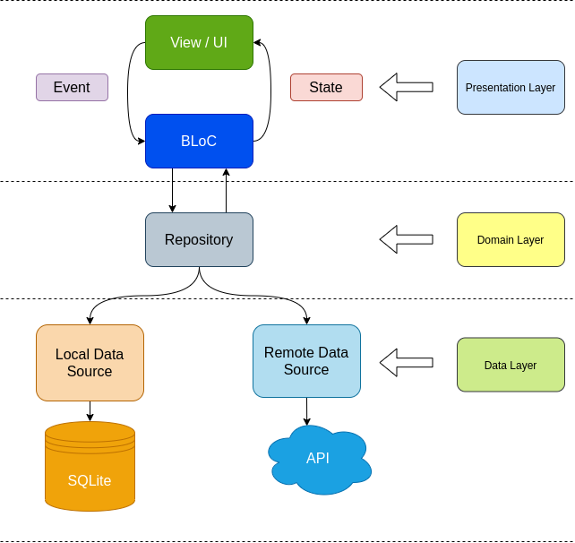
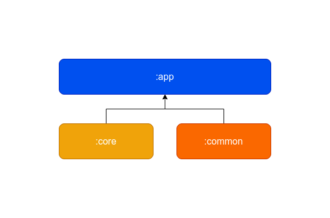

# Flutter Clean Arch

An example Flutter clean architecture component based on [Android Architecture Component](https://developer.android.com/jetpack/guide).

  

# Package
- [Dio](https://pub.dev/packages/dio) for network services.
- [Moor](https://pub.dev/packages/moor) for persistance data.
- [Provider](https://pub.dev/packages/provider) for dependency injection
- [BLoC from Scratch](https://www.youtube.com/watch?v=oxeYeMHVLII&ab_channel=ResoCoder)

# Branch
This example contains 2 branch :
- master : is an example flutter clean architecture
- modularization : is an example implementation modularization in flutter with clean architecture.

# Modularization 
Modularization in flutter apps represents a software design pattern that separates functionalities into modules. Each flutter application can be modularized by dividing the application module into library modules. As monolith application grows it becomes less and less maintainable and there is the need to split it in separate modules. See the explaination about modularization on this [video](https://www.youtube.com/watch?v=PZBg5DIzNww&ab_channel=AndroidDevelopers)

  

# Article
Hey you can read this [article](https://medium.com/@derangga/flutter-clean-architecture-bloc-streams-89fc2c9146f) for the explaination, but it's Indonesia version 🙂